# Emutet

### Summary
Emotet is one of the most active malwares nowadays, every day you can find new campaigns and new binaries. Emotet is a downloader that is able to download new modules with new features.

Emotet is also used to download third party malware on infected machines. Over the last few years Emotet has been seen distributing malware such as IceID, Trickbot and Ursnif.

All these malware have the capability to steal bank information from infected computers. Emotet consists of more than 1 botnet extended worldwide and everyone is aware of the new movements of this botnet, to such an extent that almost every day a new article talking about Emotet is published.

### Repository content
This repository has been created with the idea of helping the community of cybersecurity researchers and malware researchers. It explains in detail how the network communication protocol used by Emotet to communicate with the C&Cs works.

Knowing all these details, it should be relatively easy to emulate the communication, and obtain the new modules and distributed malware directly from the c&c. 

That's why in this repository there is also the code used to emulate Emotet's communication. This code is integrated with https://www.capesandbox.com. In this way we only have to pass as argument the ID of a CAPE analysis, to automatically instantiate an Emotet bot that will try to download new modules.

### Usage
> Remember to install all requeriments first 

**Triage**
Given the following triage analysis https://tria.ge/reports/191017-h6k7yj8vq6/task1
```
cd emutet
python emutet.py -T --triage 191017-h6k7yj8vq6
```

**CAPE**
Given the following cape analysis https://www.capesandbox.com/analysis/3062/
```
cd emutet
python emutet.py -T --cape 3062
```

For more info read [this](./emutet/README.md)

In case of success something similar to the following will appear on the screen:

[](https://asciinema.org/a/275990)

In this way it is possible to track in real time the servers controlled by the attackers and anticipate new attacks.

The following section explains in detail how the network protocol works.

# Network Protocol

Once a host has been infected with Emotet, the host waits for commands from the control panel. One important thing to keep in mind is that each Emotet binary has a configuration. This configuration has two elements:
  * **A list of IPs and ports.** These IPs are directly the C&Cs, from which the different modules and/or malware to be distributed at that given moment will be downloaded.
  * **A RSA public key.** This RSA public key is used to encrypt the symmetric session key.

To extract this configuration we can use tools like **CAPE** (https://capesandbox.com) or **Triage** (https://tria.ge) which extract them automatically. Or we can set up our own sandboxing environment and add the necessary processes to extract this information.

**Hatching/Triage** - https://tria.ge/reports/191013-xrcw9krzfj/task1

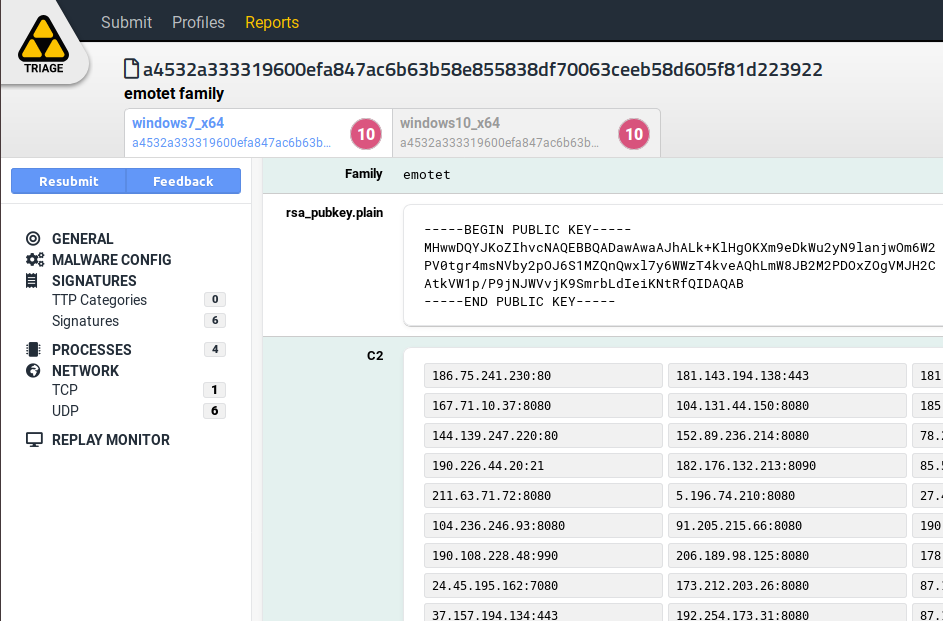


**CAPE sandbox** - https://capesandbox.com/analysis/2974/

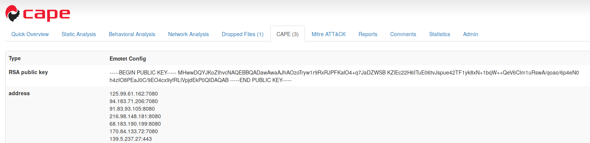


Using this list together with the public key, communication between the infected host and the control panel takes place.

### Summary

If a system has been infected correctly and the C&Cs are active, the communication from the infected machine to the C&C controlled by the attackers is done in the following way.

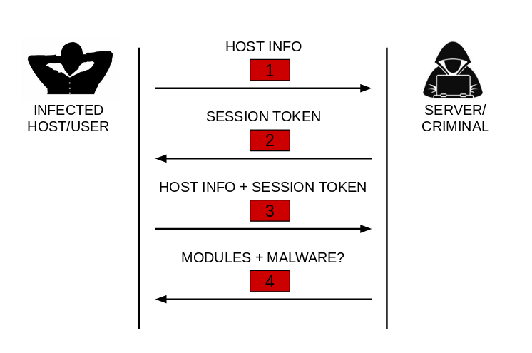

Communication consists of 4 steps. The encryption of the communication as well as the detailed content of each packet is described in the following sections. Each step could be summarized as follows:

  1. This packet contains the user name, system architecture, the list of processes running in the system...
  2. The server responds with a PE executable file. This file is used as a session token. The file is hashed using the CRC32 algorithm and this value is added in future packages sent by the infected host. If this value is wrong when the packets are sent, `step (4)` will never happen, since this value works as a session token.
  3. The same information is sent again as in `step (1)`, but this time the value obtained in `step (2)` is added (session token).
  4. This packet contains a list of PE files. This list usually contains different Emotet modules. Although from time to time, in case they are distributing malware, it also contains an additional file, corresponding to the malware that is being distributed at that moment.
Emotet modules are DLLs and are loaded directly into memory so they are not saved into disk and are often difficult to obtain them.

Below is a Wireshark screenshot of a request from a host infected by Emotet.

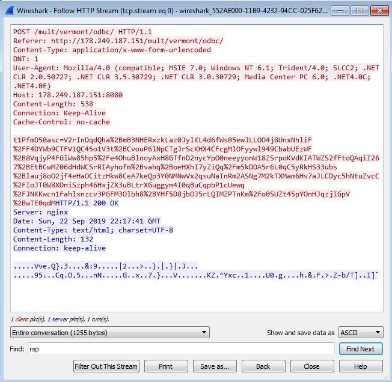

This capture corresponds to `step (3)` or `step (4)`, Analyzing a little the response of the server you can see that it is very small, so you can guess that it has not received any module. This could mean 2 things.
  1. The correct request has not been made and the server does not respond with the modules. This is a way for them to protect themselves against bots and curious people...
  2. The country the request was made from is not among Emotet's targets.
  
In the case of receiving some module, the response of the server would be much bigger.

Some fields of the request header should be highlighted. Since probably if these fields are misconfigured the control panel will not respond correctly. This is a typical measure used by attackers control panels to go unnoticed and not raise suspicions.
  * It's a POST request.
  * The request is made to a specific path in this case to /mult/vermont/odbc. This path varies as it is randomly generated by Emotet.
  * The Referer field is also added exclusively by Emotet.
  * The Content-Type field does not vary between requests as it is hardcoded in the Emotet code.
  * The DNT field is also hardcoded by Emotet.
  * Finally to emphasize would be the payload of the request, in this case you see a variable that is assigned data in base64. The name of the variable in this case is `t1PfmD50asc` and varies between requests as it is randomly generated by Emotet. However the data in base64 is data related to the infected host.
  
This article tries to explain how this data is generated and sent/received to/from the server. Also 
to learn how the Emotet communication protocol works internally and to be able to create a bot that emulates this communication and to be capable of communicating directly with the control panels. (Although this emulator is already provided in this repository)

The data that is finally sent and received from the server is basically generated as shown below:

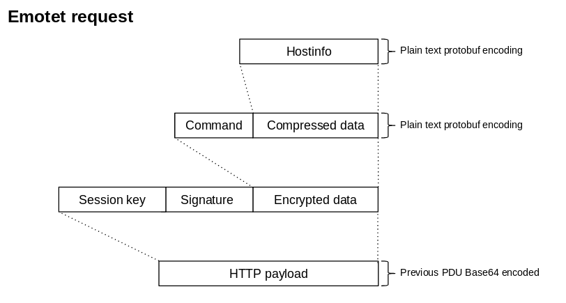

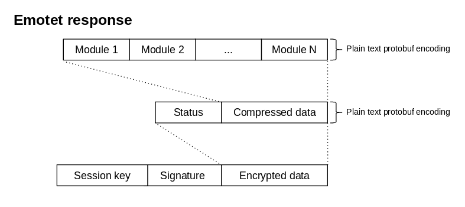

The data is encoded and encrypted before being sent. The following sections explain how this data is encoded and then encrypted

### Encoding

This section focuses on how packets sent from the infected host to the server are encoded. Although the process is similar for packets sent from the server to the infected host, we will not go into detail as these are encoded on the server to which we do not have access. However, the server's response is discussed below.

All packets before being encrypted are encoded in a specific way. In this case Emotet uses the protobufs to encode the data it sends, both from the infected host to the server and from the server to the infected host.

Below is the definition of these protobuf:

```
syntax = "proto2";

message HostInfo {
    required int32 scmanager = 1;
    required string bot_id = 2;
    required int32 arch = 3;
    required int32 session_id = 4;
    required fixed32 file_crc32 = 5;
    required string proccess_list = 6;
    required string unknown = 7;
}

message C2Request {
    required int32 command = 1;
    required bytes data = 2; //HostInfo compressed by zlib
}

message C2Response {
    required int32 status = 1;
    optional bytes file = 2;
    optional bytes modules = 3;
}

message Module {
    required int32 id = 1;
    required int32 action = 2;
    required bytes data = 3;
}
```

Requests that are sent from the infected host to the server ( `steps (1) and (3)` ) are composed as follows:
  * `HostInfo` structure is filled and serialized using the protobuf
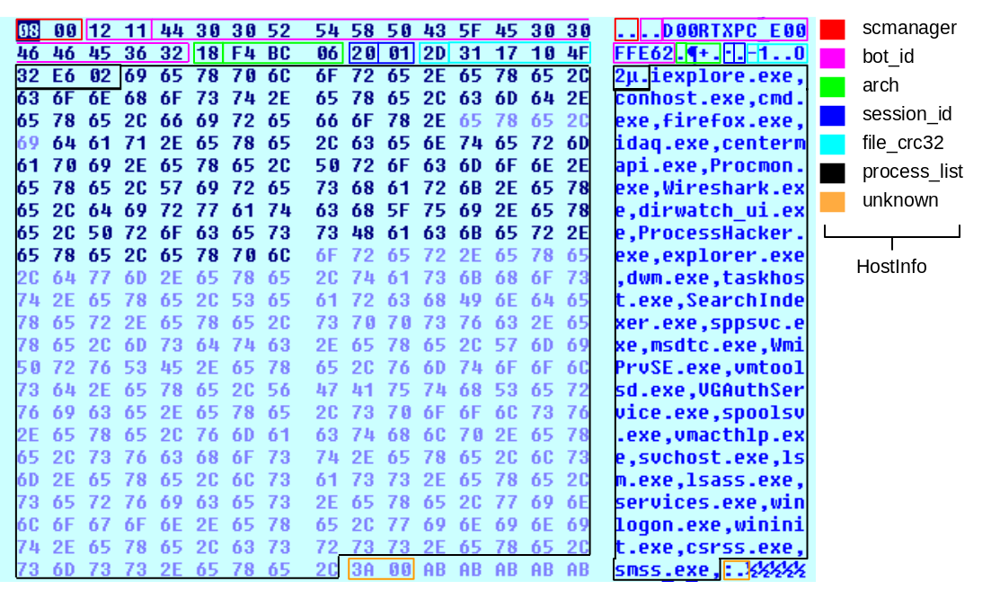
  * The serialized/encoded data is compresed using zlib
  * Then the `C2Request` structure is filled, the command field always has the value 16 (0x10) and the data field is filled with the data compressed in the previous step.
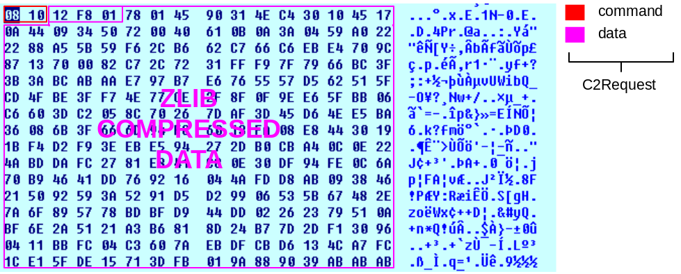

The server responses are built in the same way, but in this case what the server sends is a list of modules.

After encode the data, it's encrypted as explained below.

### Encryption

Once the packets are encoded as explained in the previous section, the packer is encrypted using the following encryption scheme:

  * A 128-bit AES key is generated with which the encoded data is encrypted. In this case the AES CBC mode is used for encryption.
  * The encrypted data is hashed using the SHA-128 algorithm.
  * The AES key used to encrypt the data is encrypted (exported) using the RSA key that contains the binary. This key can be obtained automatically using **Triage** or **CAPE** as explained above.

The encryption scheme used is similar to the one defined by GPG.

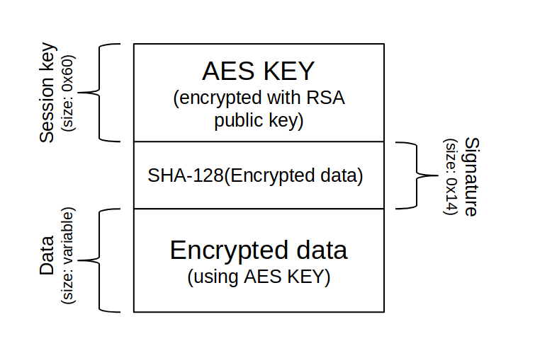

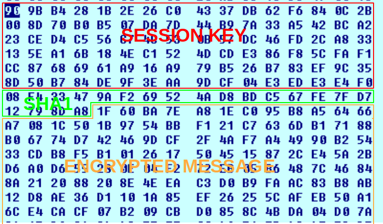

In the case of requests from the infected host to the server, this data will be encoded using base64 and sent in the POST request, while the requests from the server to the infected host will be sent in raw. As shown in the Wireshark image

# Emotet tracking
>In this section I explain how I have been tracking Emotet for a few weeks since I made the bot. In this section there are technical things but also my personal opinion, because I have done this job in my spare time, I have not had nor do I have much time to devote 100% to it and everything is not technically verified. Another thing to keep in mind, is that all the tests I have done are black box, because I do not have access to the code of the servers, so in this section you will find many assumptions created under my experience that do not have to be 100% real. 

Using the bot found in this repository, I've been tracing the different Emotet botnets for a couple of weeks and here are some conclusions I've reached.

As shown in protobuf definition, emotet modules have 3 fields
```
message Module {
    required int32 id = 1;
    required int32 action = 2;
    required bytes data = 3;
}
```
  * `id` field. This id identifies the module type. I didn't find a good explanaition about this field. But it follows a pattern. This id is always a value between 300 and 2000. Usually the DLLs have a lower value than the EXEs.
  * `action` field. This field indicates how the module should be executed. We can find 2 values during the time the tracking has lasted, `1` and `3`. If the value is `3` it means that the module must be loaded in memory using a loader Emotet has. If the value is `1` it means it is gonna be stored in disk and executed as a new process. The Emotet modules (DLLs) usually have the value `3` whereas the malware they are spreading (which are EXE files) have the value `1`
  * `data` field. A DLL or an EXE file.
  
The collected files from the botnet that are in this repository are ordered by id and action. This way maybe someone can guess the real meaning of this id field

### Downloaded modules (DLL files)

During these weeks of analysis, I have obtained about 600 unique files distributed inside Emotet's botnets. Most of these files are not in VirusTotal as Emotet does not save them to disk and they are difficult to get if you don't have a bot. The file [emotet_botnet_modules_and_malware.zip](https://mega.nz/#!qsVEgAbC!5whFUe2tatnFZcRlAb_JqEMTnzpy3QBSzJ--oM5MPjc) contains these files. The password is `d00rt-emotet`.

Every time a request is made to download the modules, in case of success, they are always received in groups of between 3 and 13 modules. If these requests are made on different days the hash of these modules will be different but they will still come in packs of between 3 and 13 modules.

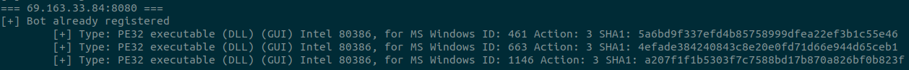

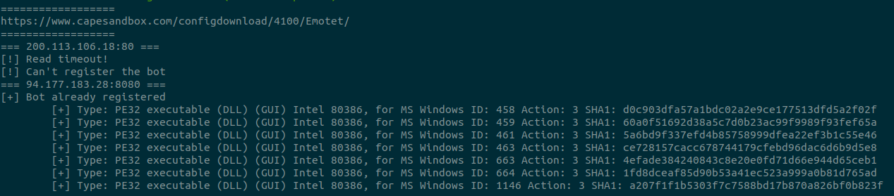


I guess (I didn't have time to analyze all of them) that the functionality of the modules remains the same but changes its hash. This way it is more difficult to detect them by the antivirus.

Although looking at the hash of the modules obtained there are more than 600 different modules, really, I think there are only about 13 unique modules. Simply the modules are updated to change the hash and thus bypass the antivirus. 

### Distributed malware

Not all files downloaded from the botnet are modules of Emotet itself. Executable files can also be found. These files are other malwares distributed by Emotet. During the weeks the botnet has been tracketed only samples of Trickbot and Ursnif have been obtained.

The file [emotet_botnet_malware.zip](https://mega.nz/#!Pt1TwQ7b!OwFW8T5mhJ7sX0S_LmZvfZJpooBAp_9BhPaRiv8t7Bg) contains these files. The password is `d00rt-emotet`.


|                     SHA-1                |  FAMILY  |                    REPORT                       |
| ---------------------------------------- | -------- | ----------------------------------------------- |
| 1aea1121475df57b5802c84583c4dc89500baa75 | Trickbot | <a href="https://tria.ge/reports/191018-5prbh9aams/task1"> View report</a> |
| 1bbbae729c33ea1ff7f99ddca6317e05a4242d63 | Ursnif   | <a href="https://tria.ge/reports/191018-jyewsk7k72/task1"> View report</a> |
| 2eb72c4993a981c9480427c83338105bcd0d863d | Trickbot | <a href="https://tria.ge/reports/191018-m9ktjhnaq6/task1"> View report</a> |
| 2f8b0b6435ca18da75e8ae2e6745718124a26f66 | Trickbot | <a href="https://tria.ge/reports/191018-dj47fcq5ta/task1"> View report</a> |
| 30ebf4174d1703dd66d867ba65cd015d3604c938 | Trickbot | <a href="https://tria.ge/reports/191018-9z5rvjxg6s/task1"> View report</a> |
| 36c09a576e35a70e5400c545c19f3ad5420e4c33 | Trickbot | <a href="https://tria.ge/reports/191018-j1rn7h112e/task1"> View report</a> |
| 3ab810973efe13af16639485547817bf1a84bb84 | Trickbot | <a href="https://tria.ge/reports/191018-hqb4vww18x/task1"> View report</a> |
| 41ed194a7310eae9620d1b4facfbc33fb246c079 | Trickbot | <a href="https://tria.ge/reports/191018-h4wh8mye46/task1"> View report</a> |
| 428f9a2b4cbc33879806996a030c02f0e60521b9 | Trickbot | <a href="https://tria.ge/reports/191018-xkfwrmh4f2/task1"> View report</a> |
| 42cb5218b9b949231f3c601715e80aab3d416f91 | Ursnif   | <a href="https://tria.ge/reports/191018-ze7jdhqtg6/task1"> View report</a> |
| 4fa87ea1426e9d02c0aebe5fdefd03b42cb6640a | Trickbot | <a href="https://tria.ge/reports/191018-8bvc9711j2/task1"> View report</a> |
| 5abdb8b16f503976c3e726521c1f93b927931c00 | Ursnif   | <a href="https://tria.ge/reports/191018-xssrgacz7s/task1"> View report</a> |
| 60ae3209413136b40ab2b4fcd11884d6dfeb330b | Trickbot | <a href="https://tria.ge/reports/191018-5dpavxa8bj/task1"> View report</a> |
| 74e9f572b117ae54bbe6d3055332117071bc6e40 | Trickbot | <a href="https://tria.ge/reports/191018-yl64kemqrx/task1"> View report</a> |
| 8ad35f111142e94599955379dad6fe8040789f0b | Ursnif   | <a href="https://tria.ge/reports/191018-6cbxhgqhwx/task1"> View report</a> |
| 8ec9d7a0c950e4f013f9afc76d807e597d7cad9a | Ursnif   | <a href="https://tria.ge/reports/191018-qqj5ysk7q6/task1"> View report</a> |
| 9193eaeff8fff6c8b09dc370b9e60ddab5b121a3 | Ursnif   | <a href="https://tria.ge/reports/191018-z54frb66pa/task1"> View report</a> |
| 9957fe40ae9a7a2630593fd82544d4ea39ca47d7 | Trickbot | <a href="https://tria.ge/reports/191018-pjatzgm2xn/task1"> View report</a> |
| a038cf5f99d17df1e223aaf2f5f80b4b4a440a4e | Ursnif   | <a href="https://tria.ge/reports/191018-7wl797zm62/task1"> View report</a> |
| b70119e477f01a901a14a0378ced471f93cee7f6 | Trickbot | <a href="https://tria.ge/reports/191018-n76fe2empj/task1"> View report</a> |
| d0a308811bd0cf98b7f3c13328f34e192ae9f07c | Ursnif   | <a href="https://tria.ge/reports/191018-dhmnstln9e/task1"> View report</a> |
| ecf315df8321b5bee5395cff7add2206d385dab0 | Trickbot | <a href="https://tria.ge/reports/191018-tgvqksr3x6/task1"> View report</a> |
| eed62d01218a450c4130ca196256b90cb815a987 | Trickbot | <a href="https://tria.ge/reports/191018-jnffne1l7x/task1"> View report</a> |
| f0a6bef71d57feee7c036899edc337bc1fb69160 | Trickbot | <a href="https://tria.ge/reports/191018-tfbpyxqage/task1"> View report</a> |
| fec98b8cdd890124ce5c203a64b38050f5459801 | Trickbot | <a href="https://tria.ge/reports/191018-qj96et9cnj/task1"> View report</a> |

### Country

One important thing to keep in mind is that it depends on the country from which we make the request the botnet will serve some files or others. So for the tracking has been used a VPN to make the request from different countries.

Three different scenarios can happen when we connect from a specific country:
  1. The country from which we connect is not among Emotet's objectives and we do not receive any module. 
  2. The Country from which we connect only receives modules but not malware. In this case, it can be said that this Country is a possible target of Emotet and at that moment it is not distributing malware for that Country.
  3. The Country from which we connect receives the modules and the malware. In this case it can be said 100% that this country is a target of Emotet and that they are currently spreading malware in their botnet.

### Wrong approach but cool map

After a few days inside Emotet's botnet I noticed the following, each bot registered in the botnet is uniquely identified by the `bot_id` that is sent to the server (it makes sense) and is identified in all botnets. 

**What does this mean in terms of tracking?** Once a bot is registered in the botnet it will **always** receive the same files regardless of the Country from which it connects and regardless of which of the 3 knoen botnets it connects.

For example:
  * You create a bot using the emulator with the bot id `D00RT_PC` 
  * You connect from Japan to botnet 1
  * You receive 3 modules and 1 malware
  
From that moment if you connect again with the bot id `D00RT_PC` from any country and to any botnet, the same modules and the same malware will always be received.

When I started to track Emotet I didn't know this, so my first approach was to always use the same bot id and connect from all countries.


As already explained this approach is not valid ... but as I lost time in making this cool map and I like it, I leave here a video :D

The correct way of tracking Emotet is to create a new **bot id** every time we connect to the botnet. Although this does not always work as explained in the next section and can generate a lot of noise in the servers controlled by the actors.

### Problems communicating with the botnet

Even having all the knowledge of how the protocol works (from the client side) certain problems have been encountered when communicating with the C&C. Here is a list of things to keep in mind in order to make a successful communication:

  * The bot id. This field is decisive because sometimes I think I have been banned based on the bot id. I have also had the feeling that once a bot has been served with a malware, it has a few days of use and then it is banned from the botnet to not distribute more malware (this is just a theory based on my experience).
  * Country. It is important to connect from a country that is among the targets of Emotet. otherwise we will not get an answer.
  * Time and day. I noticed that on weekends the botnets are not usually active so you have to take this into account. Also the time at which you connect can also affect the time to have an answer or another from the C&C.

# Interesting related articles
  1. **[Exploring Emotet, an elaborate everyday enigma](https://www.virusbulletin.com/uploads/pdf/conference_slides/2019/VB2019-Nagy.pdf)** - [Luca Nagy](https://twitter.com/luca_nagy_)

  2. **[Emotet: The Tricky Trojan that ‘Git Clones](https://research.checkpoint.com/emotet-tricky-trojan-git-clones/)** - Ofer Caspi, Ben Herzog

# Last notes

The Emotet network protocol may change after this release, sorry to all researchers who will have to modify the bot. I've seen how the protocol has changed 3 times since I've been following this family, so if not for this reason they would change it for another reason.

I hope at least that it helps the community to trace this family (until the protocol changes) and that people who are starting in this world know how these advanced malwares work and how to trace them.

I want to give a shout-out to [Cryptolaemus](https://twitter.com/Cryptolaemus1), [Joseph Roosen](https://twitter.com/JRoosen) and the group of researchers for the excellent job tracking the documents, links and binaries that are distributed every day by SPAM or whatever by Emotet actors. Also thanks to [CAPE](https://capesandbox.com/) and [Triage](https://tria.ge) for suppoting Emotet config extractor :D

I don't have much time to maintain this repository although I'm open to improvements and suggestions. I will try to answer questions when I can. Sorry, I don't think I can update the repository very often. Bills don't pay themselves.

Thanks for reading to the end and I hope you enjoyed it as much as I enjoyed doing the bot.

-- [d00rt](https://twitter.com/D00RT_RM) --
